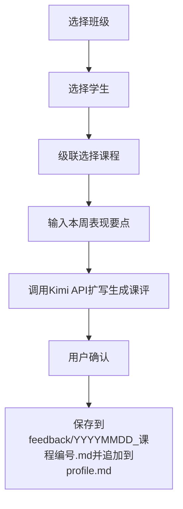
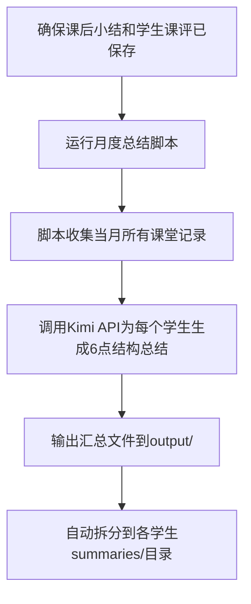
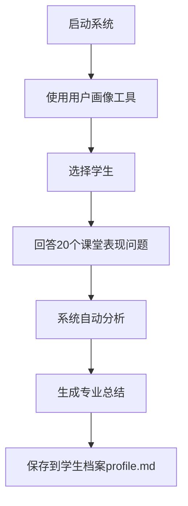

# 课评自动生成系统 - 项目结构索引

## 项目概览

一个帮助编程老师自动生成学生课评的Web系统，包含用户画像分析、OJ数据拉取、数据管理和可视化界面。支持 Kitten（图形化编程）、C++（CSP阶段）、AI 三种课程类型的课评生成，以及月度总结自动生成。

---

## 文件树结构

```
class-review-system/
├── .claude/                       # Claude Code 配置目录
│   ├── MEMORY.md                  # Claude Memory 索引
│   ├── memory/                    # 跨对话持久化记忆
│   │   ├── class/                 # 【班级数据 - 核心课评目录】
│   │   │   ├── AICODE01示例周五1900/          # AI编程班 (示例老师 周五 19:00)
│   │   │   ├── AICODE03示例周日1045/          # AI编程班 (示例老师 周日 10:45)
│   │   │   ├── CSP01示例周六0830/             # C++入门班 (示例老师 周六 08:30)
│   │   │   ├── CSP04示例周六1610/             # C++进阶班 (示例老师 周六 16:10)
│   │   │   ├── K2示例周日0845/                # Kitten图形化K2班 (示例老师 周日 08:45)
│   │   │   ├── K2东东周日1600/                # Kitten图形化K2班 (东东老师 周日 16:00)
│   │   │   ├── K4示例周六1045/                # Kitten图形化K4班 (示例老师 周六 10:45)
│   │   │   ├── K4示例周六1400/                # Kitten图形化K4班 (示例老师 周六 14:00)
│   │   │   │   ├── summaries/                 # 班级课后小结 (C++全班)
│   │   │   │   ├── 补课/                      # 补课学生专用目录
│   │   │   │   ├── 学生姓名1/                 # 学生个人文件夹
│   │   │   │   │   ├── feedback/              # 【个人课评目录】
│   │   │   │   │   │   ├── YYYYMMDD_课程编号.md              # 正常课评
│   │   │   │   │   │   ├── YYYYMMDD_课程编号(请假).md        # 请假记录
│   │   │   │   │   │   └── YYYYMMDD_课程编号(补课-去班级名).md # 补课追踪
│   │   │   │   │   ├── summaries/             # 【个人月度总结】
│   │   │   │   │   │   └── YYYY-MM_月度总结.md               # 月度总结
│   │   │   │   │   └── profile.md             # 学生画像 (YAML Frontmatter + Markdown)
│   │   │   │   └── 学生姓名2/
│   │   │   │       └── ...
│   │   ├── lesson/                # 课程大纲资料
│   │   ├── oj/                    # OJ数据分析缓存
│   │   │   └── analysis/          # OJ学生分析JSON缓存
│   │   ├── project/               # 项目状态
│   │   │   ├── goals.md           # 项目目标、里程碑
│   │   │   └── architecture.md    # 技术架构、决策记录
│   │   └── user/                  # 用户信息
│   │       └── developer.md       # 开发者信息、技术栈、协作偏好
│   ├── rules/                     # 自动触发规则
│   │   ├── on-generate-review-kitten.md
│   │   ├── on-generate-review-cpp.md
│   │   └── on-generate-review-ai.md
│   └── skills/                    # 技能扩展
│       └── wenbin-weekly-report/  # 文彬教学周报推送技能
│           ├── SKILL.md
│           ├── scripts/
│           └── reports/
├── data/                          # 数据源目录
│   ├── courses/                   # 课程内容（Markdown）
│   │   ├── C++/
│   │   │   ├── CSP01示例周六0830/ # 14课时（01走进C++ ~ 14阶段测试）
│   │   │   └── CSP04示例周六1610/ # 12课时（01简单排序 ~ 12 C4阶段测试）
│   │   ├── AI/
│   │   │   ├── AICODE-03/         # AI入门课程
│   │   │   └── AICODE-06/         # AI进阶课程
│   │   └── kitten/
│   │       ├── 乐学课堂/          # 48课时
│   │       └── 萌新大课堂/        # 47课时
│   └── templates/                 # 数据模板
│       └── 学生信息模板.md
├── output/                        # 输出目录
│   └── YYYY年M月月度表现总结_AI版.md   # AI生成的月度汇总文件
├── references/                    # 专业参考资料库
│   ├── age-psychology/            # 年龄段心理特点（6-8岁/9-11岁/12-14岁）
│   ├── course-difficulties/       # 课程常见困难（C++/Kitten）
│   ├── learning-stages/           # 学习阶段特征（入门期/适应期/突破期/进阶期）
│   ├── encouragement/             # 鼓励话术库（针对不同性格/挫折场景/进步类型）
│   └── teacher-style/             # 教师实际课评风格样本
│       ├── C++.md
│       ├── KITTEN.md
│       └── AI.md
├── rules/                         # 课评生成规则
│   ├── c++-style.md               # C++课后小结规则（全班一篇）
│   ├── kitten-style.md            # Kitten单节课评规则
│   └── ai-style.md                # AI课评规则
├── skills/                        # 技能库
│   ├── 小学生编程用户画像技能.md  # 用户画像技能（20个课堂表现类问题）
│   ├── 生成课评技能.md            # 生成学生课评技能
│   ├── 月度总结生成技能.md        # 月度总结自动生成技能
│   └── oj-course-lesson-generator.md  # OJ课程教案自动生成技能
├── src/                           # 源代码
│   ├── ai/                        # AI课评生成器
│   │   ├── review_generator.py    # 核心生成器，按技能流程执行
│   │   └── skill_creator.py       # 用户画像创建工具类
│   ├── oj/                        # OJ数据模块（新增）
│   │   ├── oj_client.py           # OJ API客户端 + 课程匹配器
│   │   ├── oj_analyzer.py         # OJ数据分析器（筛选/统计/格式化）
│   │   └── review_draft_generator.py  # 基于OJ数据生成课评草稿
│   ├── utils/                     # 工具函数
│   │   └── init_data.py           # 初始化示例数据脚本
│   └── web/                       # Web界面 (Flask)
│       ├── app.py                 # Flask应用入口（~1700行，含所有API路由）
│       ├── static/
│       │   ├── css/style.css
│       │   └── js/app.js
│       └── templates/
│           ├── base.html
│           ├── index.html           # 班级列表页
│           ├── class.html           # 学生列表页（Kitten/AI班）
│           ├── cpp_class.html       # C++班级页（含课后小结列表）
│           ├── student.html         # 学生详情/课评生成页
│           ├── cpp_review_editor.html     # C++课后小结编辑页（含OJ数据拉取）
│           ├── cpp_summary_view.html      # 课后小结查看页
│           ├── kitten_review_editor.html  # Kitten课评批量编辑器
│           ├── ai_review_editor.html      # AI课评批量编辑器
│           ├── profile_creator.html       # 用户画像创建页
│           ├── profile_creator_tabs.html  # 批量用户画像标签页版
│           ├── batch_edit_students.html   # 批量编辑学生
│           └── student_course_selector.html
├── tools/                         # 工具脚本集合
│   ├── README.md
│   ├── archive/                   # 存档脚本（旧版本，保留参考）
│   ├── course-processing/         # 课程处理工具
│   ├── docs/                      # 文档
│   ├── interaction/               # 交互式用户画像创建工具
│   ├── fetch_oj_data.py           # OJ数据独立拉取工具
│   └── student-processing/        # 学生处理工具
│       ├── apply_user_profile_skill.py
│       ├── generate_monthly_summary.py   # 月度总结生成脚本（新增）
│       ├── generate_profile_template.py
│       ├── generate_student_info.py
│       └── standardize_student_format.py
├── .env                           # 环境变量（API密钥等，Git忽略）
├── .gitignore
├── config.yaml                    # 系统配置
├── requirements.txt               # Python依赖
├── run.py                         # 启动脚本
├── README.md
├── CHANGELOG.md
├── CONTRIBUTING.md
└── LICENSE
```

---

## 核心文件功能

### 配置文件
- **config.yaml**：系统参数配置（API URL、模型、路径、Web设置、参考资料匹配规则）
- **.env**：API密钥等敏感配置（KIMI_API_KEY、OJ_BASE_URL、OJ_USERNAME、OJ_PASSWORD）

### 数据文件
- **.claude/memory/class/班级/学生/profile.md**：学生画像（Markdown + YAML Frontmatter，含gender/age等字段）
- **.claude/memory/class/班级/学生/feedback/YYYYMMDD_课程编号.md**：单次课评
- **.claude/memory/class/班级/学生/summaries/YYYY-MM_月度总结.md**：月度总结
- **.claude/memory/class/班级/summaries/YYYYMMDD_课程编号_班级反馈.md**：C++课后小结（全班）
- **.claude/memory/oj/analysis/**：OJ学生分析JSON缓存文件
- **data/courses/课程类型/班级/课时.md**：课程内容（含教学目标、核心知识点、课堂练习）
- **output/YYYY年M月月度表现总结_AI版.md**：AI生成的月度汇总文件

### 技能库
- **skills/小学生编程用户画像技能.md**：20个课堂表现类问题的完整技能
- **skills/生成课评技能.md**：根据课程目标和用户评价生成课评
- **skills/月度总结生成技能.md**：自动生成严格6点结构的月度总结
- **skills/oj-course-lesson-generator.md**：根据OJ课程页面自动生成标准化教案
- **.claude/skills/wenbin-weekly-report/**：文彬教学周报推送技能

### 参考资料
- **references/age-psychology/**：心理发展特点
- **references/course-difficulties/**：学习常见困难
- **references/learning-stages/**：学习阶段特征
- **references/encouragement/**：个性化鼓励方式
- **references/teacher-style/**：教师实际课评风格样本

### 生成规则
- **rules/c++-style.md**：C++课后小结规则（全班一篇，含出勤/核心知识点/高频易错点/各娃表现/作业清单）
- **rules/kitten-style.md**：Kitten单节课评规则（亲切口语化，200-300字）
- **rules/ai-style.md**：AI课评规则（鼓励创新，单节课或阶段评价）

### 源代码

#### Web 应用 (src/web/app.py)
Flask应用核心，包含以下API路由：

| 路由 | 功能 |
|---|---|
| `/api/courses` | 级联课程选择器 |
| `/api/generate-review` | 调用Kimi API扩写生成课评 |
| `/api/save-review` | 保存课评到feedback/ + 追加profile.md |
| `/api/save-leave` | 为请假学生生成请假记录 |
| `/api/cpp/course-info` | 获取C++课程信息（自动提取核心知识点） |
| `/api/cpp/save-summary` | 保存C++课后小结到summaries/ + 同步到全班feedback/ |
| `/api/cpp/summaries/` | 获取课后小结列表 |
| `/api/cpp/fetch-oj-review-draft` | 从OJ拉取数据并生成课评草稿 |
| `/api/git-push` | Git add → commit → push |
| `/api/profile/questions` | 获取用户画像问题 |
| `/api/profile/create` | 创建用户画像 |
| `/upload-photo` | 照片上传 |

#### OJ 数据模块 (src/oj/)
- **oj_client.py**：OJ API客户端 + 课程匹配器
  - `OJClient`：登录、获取课程列表、获取课程详情、获取分析数据
  - `OJCourseMapper`：本地课程编号 ↔ OJ课程ID匹配（支持精确匹配、编号±1回退、按时间匹配）
- **oj_analyzer.py**：OJ数据分析器
  - 按班级group或学生姓名筛选
  - 统计tid1完成率、题目状态分布
  - 检查数据新鲜度
- **review_draft_generator.py**：基于OJ数据生成课评草稿
  - 为每个学生生成个性化评价段落
  - 生成班级整体表现总结
  - 生成高频易错点提示

#### AI 生成器 (src/ai/)
- **review_generator.py**：核心课评生成器
  - 加载学生信息（含gender字段用于确定人称代词"他/她"）
  - 加载课程内容并提取教学目标
  - 读取对应课程类型的教师风格样本
  - 调用 Kimi API (Moonshot) 扩写生成课评
  - 性别代词自动修正
- **skill_creator.py**：用户画像创建工具类（20轮提问 + 分类分析 + 报告生成）

### 工具脚本 (tools/)

**活跃工具：**
- **course-processing/**：课程文件处理、教学目标提取、教案整理
- **student-processing/**：
  - `generate_monthly_summary.py` — 月度总结生成（支持`--year`、`--month`、`--classes`参数）
  - `apply_user_profile_skill.py` — 用户画像模板应用
  - `generate_profile_template.py` — 生成学生画像模板
  - `standardize_student_format.py` — 学生档案格式标准化
- **interaction/**：交互式用户画像创建工具（命令行 + HTML页面）
- **fetch_oj_data.py**：OJ数据独立拉取工具
- **docs/**：快速开始指南、使用说明

**存档工具 (tools/archive/)：**
旧版本的各种处理脚本，当前系统不再使用，但保留作为历史参考。

---

## 使用流程

### Kitten/AI 单节课评流程


### C++ 课后小结流程
```mermaid
graph TD
    A[选择C++班级] --> B[进入课后小结编辑页]
    B --> C[选择课程，自动提取核心知识点]
    C --> D[可选: 拉取OJ数据生成草稿]
    D --> E[输入出勤/请假名单]
    E --> F[输入各娃表现（请假学生自动跳过）]
    F --> G[输入回家作业]
    G --> H[生成并保存课后小结]
    H --> I[自动同步到全班学生feedback/目录]
    H --> J[为请假学生生成feedback/YYYYMMDD_课程编号(请假).md]
```

### OJ 数据拉取流程
```mermaid
graph TD
    A[进入C++课后小结编辑页] --> B[点击"拉取OJ数据"]
    B --> C[系统自动匹配OJ课程编号]
    C --> D[获取学生做题统计]
    D --> E[生成各娃表现草稿]
    E --> F[老师在此基础上修改完善]
```

### 月度总结生成流程


### 用户画像创建流程


---

## 注意事项

### 课评生成要点
1. **性别识别**：系统读取profile.md中的gender字段，确保使用正确的人称代词（他/她）
2. **字数控制**：Kitten/AI课评150-200字，C++各娃表现简洁具体
3. **评价平衡**：优点与不足比例约6:4或7:3，避免全是表扬
4. **风格模仿**：优先参考references/teacher-style/中的真实课评样本
5. **禁止编造**：严格基于老师输入的表现要点扩写，不添加未提及内容

### C++课后小结规范
1. **文件命名**：`YYYYMMDD_课程编号_班级反馈.md`
2. **同步机制**：保存到summaries/的同时自动同步到每位学生的feedback/
3. **格式要求**：必须包含出勤、核心知识点（标注掌握程度）、高频易错点、各娃表现、作业清单
4. **OJ数据**：CSP04本地编号与OJ编号有+1偏移（本地12 → OJ 13），系统已自动处理

### 月度总结规范
1. **生成时机**：每月最后一天或下月初，确认当月所有课评已保存后执行
2. **6点结构**：本月学了什么 / OJ数据表现 / 具体进步 / 具体问题 / 训练建议 / 老师综合评价
3. **数据源**：优先从课后小结的「各娃表现」提取，OJ数据仅作参考，不可靠时不编造
4. **文件命名**：`YYYY-MM_月度总结.md`

### 用户画像创建前的准备
1. **了解学生基本信息**：系统会读取学生的姓名、班级等基本信息
2. **熟悉问题分类**：20个问题分为课堂参与、学习态度、学习能力、编程技能、综合评价五大类
3. **准备具体实例**：需要准备学生在课堂上的具体表现实例

---

## 技术栈
- **后端**：Python + Flask + Jinja2
- **前端**：HTML5 + CSS3 + JavaScript + Bootstrap
- **AI服务**：Kimi API (Moonshot) - OpenAI兼容格式，模型moonshot-v1-8k
- **OJ服务**：HydroOJ-Course-Keli365插件（https://oj.example.com）
- **API密钥管理**：优先从.env文件读取KIMI_API_KEY、OJ凭据
- **数据处理**：Python + 正则表达式 + 文本解析
- **可视化**：mermaid流程图 + Markdown渲染
- **数据格式**：Markdown + YAML + JSON
- **版本控制**：Git（支持一键推送）
